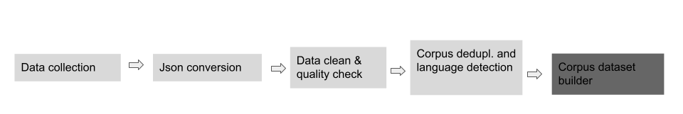

# Routines for creating a Huggingface Dataset

This is a general description for creating a huggingface dataset. It shows all the necessary steps to do the process from data generated with "corpus_dataset_builder.py" to finished dataset in huggingface. As an example we use one of our open datasets so the process can be visible. All scripts used for this task is available from this site. We use the dataset "dedup" as the example. 

Log in to your huggingface account and create your empty corpus

# Create empty dataset

*In your top right menu from huggingface, select "new dataset". Set the proper settings private/public, although you will be better off to set the dataset to public for the duration of the creation. After this you can switch the dataset to private. This is done through the huggingface menus for datasets.*

*Go to your local environment (where you store your different corpi)*
**Warning: if you're corpus contains files over 1 GB do not use nfsmounted storage.**

```bash
cd corpus/corpus_collections_5


```

Checkout first version of the corpus:

```bash
cd corpus/corpus_collections_5
git clone https://huggingface.co/datasets/<owner>/dedup
cd dedup
git lfs track "*tfevents*"
git lfs track "*model*"
git lfs track "*gz*"
git lfs track "*md*"
huggingface-cli lfs-enable-largefiles .

```
After this you can create or modify the contents of your dataset with the dataset builder (datasetname is 'dedup' as an example) and the folder 
'corpus/corpus_files_4/dedup' contains all the necessary files.

```bash
cd ~

python corpus_dataset_builder.py --input_folder corpus/corpus_files_4/dedup --output_folder corpus/corpus_collections_5/dedup 
```

The dataset builder does the following tasks:

* Generate a datacard
* Read and shuffle your dataset file
* Create a train and validation split (each train shard is by default 1 Gb and the validation split is 1 GB) on the proper format. Changeable.
* Create single train and validation files 
* Create dummy training and a dummy validation file on the proper format.
* Creates statistics of your dataset (word counts,year distribution,no of documents).
* Generates a python loader functions *"dedup.py"*

**Make dummy dataset**

The files for the dummy dataset is ready for you.

```bash
cd ~
cd corpus/corpus_collections_5
datasets-cli dummy_data dedup
cd dedup/dummy/dedup/0.0.0
mkdir dummy_data
cp ../../../complete_all/train-shard-0001-of* dummy_data/.
cp ../../../complete_all/validation-shard-0001-of* dummy_data/.
zip -r dummy_data.zip dummy_data/
rm -r dummy_data/
cd ../../../

```


After this you can check in your dataset. Here we do a check in of the example "dedup":
```bash
cd ~
cd corpus/corpus_collections_5/dedup
git add .
git commit -m "First commit of dataset dedup"
git push

```
All files are named and packed with the naming rules of huggingface in mind.

**Test dataset**
``bash
cd ~
cd corpus/corpus_collections_5/
datasets-cli test dedup
```

After this you can check 


And upload all the sharded files to the bucket

```
gsutil -m cp *shard*.gz gs://notram-west4-a/pretrain_datasets/nb_nn_balanced_shuffled/shards/ &&
gsutil -m cp nb_nn_balanced_shuffled_train.json.gz gs://notram-west4-a/pretrain_datasets/nb_nn_balanced_shuffled/splits/ &&
gsutil -m cp nb_nn_balanced_shuffled_test.json.gz gs://notram-west4-a/pretrain_datasets/nb_nn_balanced_shuffled/splits/ &&v
gsutil -m cp nb_nn_balanced_shuffled_validation.json.gz gs://notram-west4-a/pretrain_datasets/nb_nn_balanced_shuffled/splits/

```
